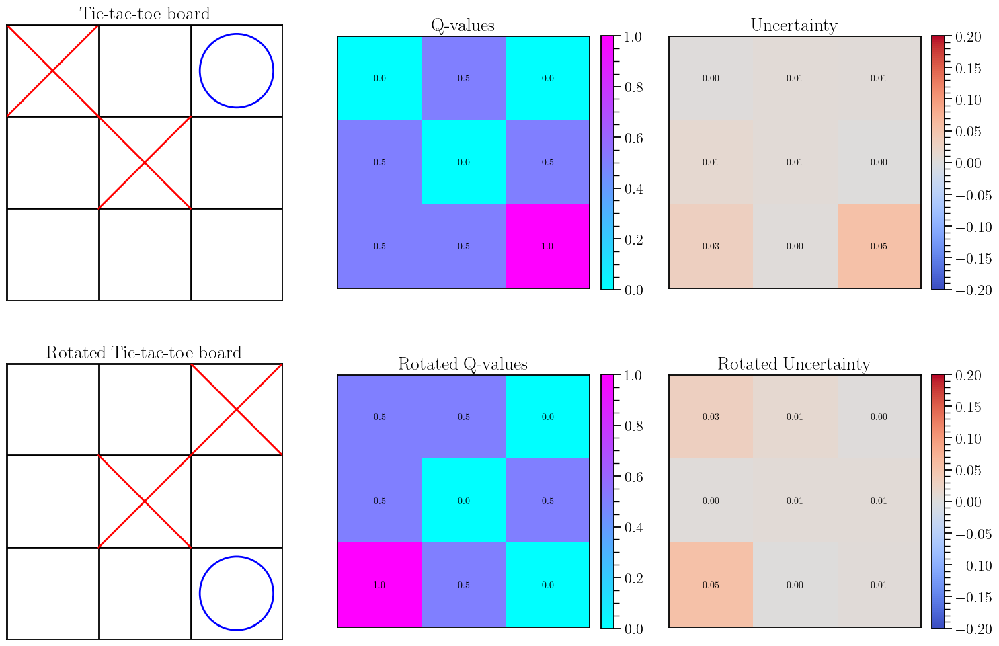

# On Uncertainty Calibration for Equivariant Functions

This repository contains all code for `On Uncertainty Calibration for Equivariant Functions` by [Edward Berman](https://ebrmn.space/) and [Jacob Ginesin](https://jakegines.in/), advised by [Robin Walters](https://www.robinwalters.com/). This work is a product of our Mathematics Research Capstone course (Math 4020) at Northeastern University. 

# Running Experiments

First, clone the repo (and the submodules!) via

`git clone --recurse-submodules https://github.com/EdwardBerman/EquivariantUQBounds.git`

## Vector Field Regression

Refer to the README.md in the folder for the experiment

## Swiss Roll

Instructions are in the `ext_theory` Git submodule on how to run the "spiral" experiment

## Galaxy Morphology

Instructions are in the `SIDDA` Git submodule on how to run, including a script for producing the noised version of the dataset and a zenodo link to the default .npy files

## Chemical Scalar Properties

Run the `run.py` script in `/uq_bleading/`

## Chemical Vector Properties

See the SEGNN submodule. Specific training scripts will be added upon completion of a follow-up work.
